# **Reminiscence**

## **Repository Contents:**

The following are the main components of our project as viewed from our repository.

| Item | Description |
| -------- | ------- |
| Top-Level README | A comprehensive report on our project and its development.  |
| MyScrapBookApp.py | A Python file containing the main script where the application's internal structure is managed.  |
| myscrapbookapp.kv | A Kivy file containing the visual structure of the application as seen by the user.  |
| Reminiscence.spec | A specifications file used by the Pyinstaller packaging tool to generate an executable file of our application along with its dependency folder. |

## **Inspiration:**
This project was inspired by our team's CMPSC 472 Operating Systems course. We were tasked as our final project to create a software application that would provide happiness to the elderly. The contents of this repository are the result of our interpretation of this prompt.

## **Team Members:**

**JoshMU1020 - Joshua Murillo**

**dweismanEDU - David Weisman**

## **Project Objectives:**

The objectives of this project are to create an application that utilizes some aspects of the information presented during our CMPSC 472 class to construct software that could provide some sense of happiness to the elderly.

Through the completion of this task, our personal goals include gaining experience in
- Critical and creative thinking when designing our software to enhance happiness.

- Developing a user-friendly interface: This application should be easy to use visually friendly and appealing. Harsh colors or complicated layouts would make the application undesirable to the elderly.

- Collaborative coding: Learning to work effectively as a team in co-developing our software project.

- Real-world application development: Applying our skills to create a practical project with real-world use cases that contribute to the well-being of the elderly.

## **Project Overview:**
Reminiscence is a Windows application aimed at providing the elderly with a way to organize data related to their past memories. The software is designed to be a scrapbook-like application that would allow users to create notes and upload images to the software which can then be organized into a collage that is then saved to a scroll view of those collages. The application can be used to store, organize, retrieve, and display memories in the form of photos and notes. The software will showcase a friendly user interface for accessing these operations while utilizing our course-related concepts to ensure smooth management of the functions required to manipulate this memory data. Concepts like those related to file management can be used in managing stored data for quick retrieval. Altogether, Reminiscence will be able to provide the elderly with a way to construct a virtual scrapbook to create a personalized journey through their past memories.

## **Software Features:**

### Provide users with a way to:
- Upload memory data including Notes and Images.
- Allow users to browse their uploaded media by choosing where to place these data items on a GUI canvas.
  - Saves these canvas pages for later viewing.
- Provide the user with a User-Friendly GUI for them to traverse through the application.

## **Technology Stack:**
**As of the current date, our tech stack includes:**

**Coding Language:** Python

**GUI Tool:** Kivy
- Kivy’s TextInput Widget: Handles creating and editing text-based notes.
- Kivy’s Image Widget: Supports features related to manipulation of images.
- Kivy’s DropFile Widget: Supports drag and drop of files into GUI for a more GUI-friendly environment.

**File Maneuvering and Storage:** 
- Python OS Module: Handles the copying, creation, and managment of files and folders related to each user's data.

## **Code Structure:**
- Present a systematic diagram of the code's structure and explanations for easy understanding.

**Class Diagram of Main Code Script:**

**Explanation:**

The class UML diagram depicts a visual explanation of the main application of the MyScrapbookApp python script. The role of this script is the be the entry point of the application. It inherits from Kivy's Screen Manager class to manage all screens who are initiated by the build function.

When the program starts, the MyScrapbookApp() class initializes the ScreenManager and adds various screens to it including the welcome, mainMenu, viewPages, and PageCreation screens. This class also manages global functions related to some of the screens.

For the **welcome screen**, this class manages the creation of accounts and verification of credentials. 

For the **PageCreation screen**, It handles file drop events and delegates them to the appropriate DropZone widgets. It also handles events related to saving user-specific data in the form of collages or 'pages' in designated directories unique to each user.

**Screens Managed by ScreenManager:**

**WelcomeScreen:**

Purpose: Manages user login and account creation.
Functionality: Allows users to log in using their credentials or create a new account. Transitions to the MainMenu screen upon successful login.

**MainMenu:**

Purpose: Provides navigation to different parts of the application.
Functionality: Offers options to view saved pages, create new pages, or log out.

**ViewPages:**

Purpose: Displays saved scrapbook pages of the logged-in user.
Functionality: Loads and shows images from the user-specific saved_collages directory.

**PageCreation:**

Purpose: 
- Allows users to create new scrapbook pages.

Functionality: 
Users can drag and drop images or type notes into DropZone areas to compose a page. Provides options to save or clear the current page.

**Custom Widget: DropZone**

- Role: 
  - A custom widget that acts as a container for dropping files or entering text.

- Functionality: 
  - Handles dropped files (images) and displays them.
  - Allows users to enter text notes.
  - Can clear its contents and reset to default state.

#
**Class Diagram of Kivy Script:**

**Explaination:**

The Kivy UML diagram depicts a visual explaination of the myscrapbookapp.kv file that works alongside the main python script that defines the layout and stylization of each screen and custom widget used in the application.

**WelcomeScreen**

Purpose: This screen serves as the entry point for users. It includes options to create a new account or log in.

Components:
- Background and Border: Set with canvas.before and canvas.after to create a colored background and a border.
- BoxLayout: Vertically arranges all child widgets.
- Label: Displays the title 'Welcome to Reminiscence!' with specific font, size, and alignment.
- Buttons (Create Account and Login): Two buttons for creating an account and logging in. Styling is applied for font, size, and colors. They also have event bindings for their respective actions.
- TextInputs (username and password): Fields for users to enter their username and password. Customized with font, size, and color.

**CreateAccountPopup**

Purpose: A popup for account creation.

Components:
- BoxLayout: Contains the input fields and a button, arranged vertically.
- TextInputs (username and password): Fields for entering a new username and password.
- Button (Create): Submits the account creation form.

**MainMenu**

Purpose: The main navigation screen after logging in.

Components:
- BoxLayout: Vertically arranges the label and buttons.
- Label: Displays 'Main Menu' with styling.
- Buttons (View Pages, Create New Page, Logout): Provide navigation to other screens and logout functionality. Styled with custom colors and sizes.

**ViewPages**

Purpose: Displays the user's saved scrapbook pages.

Components:
- BoxLayout: Contains a label and a ScrollView.
- Label: Title for the page.
- ScrollView: Contains a BoxLayout (pages_container) that will dynamically load and display images.

**CustomDropZoneLayout**

Purpose: A custom layout for the DropZone areas in the scrapbook page.

Components:
- BoxLayout: Arranges a DropZone and a custom widget.
- DropZone: Custom widget for dropping images or text.

**PageCreation**

Purpose: Interface for creating new scrapbook pages.

Components:
- GridLayout: Arranges four CustomDropZoneLayout instances in a 2x2 grid.
- Button Layout: A horizontal BoxLayout containing three buttons for navigating to the main menu, saving the page, and clearing the page.

This structure is used to provide a clear and user-friendly interface, with each screen and widget designed to fulfill specific roles within the application, from user authentication to scrapbook creation and navigation. A light blue background with large white text is used to be easy on the eyes in consideration with the potential elderly users.

## **Software Installation and Usage:**

The steps to install and run the Reminiscence application are as follows:

First, using a Windows machine, go to the link below to download a zip folder of the application.

Application Link: https://pennstateoffice365-my.sharepoint.com/:u:/g/personal/jbm6204_psu_edu/EfE1v7pNPkxEjaFgi5lu1CcB23YT30atEY45MBmGSPkESA?e=kVxEDw 

(**NOTE:** Due to the large size of the application dependency folder which is approximately 1.44 GB zipped, uploading the application folder is not easily done in GitHub. This is why a OneDrive link is used instead.)

Once downloaded, unzip the Reminiscence folder and open it. Inside you will find Two items including the Scrapbook application executable file and a dependencies folder containing all file dependencies for the python-kivy application. As the user operates the software, a non-encrypted credentials text file and a folder containing all created collages corresponding to each user will be generated in this folder.

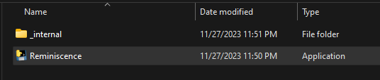

From here, double-click the Reminiscence executable to start the application. Since we are not official puplishers of any software, the user may need to ask Windows for permission to use the software. In this case, to run the software first select "More info," then select "Run Anyway" as shown below:

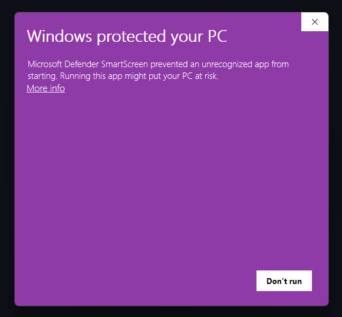
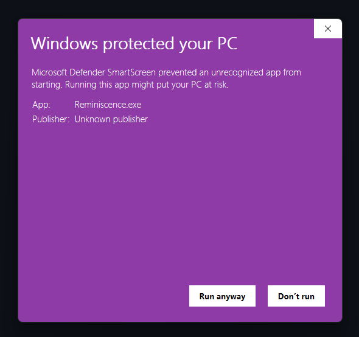

A logging command prompt will open along with the application.

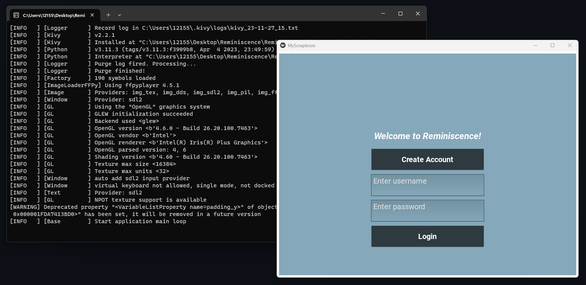

From here, the application is live and ready to be used to create collages!

## **Software Functionality Testing:**

Now that the software is open, it's time to test out its features! You can begin by creating an account with the "Create Account" button. As can be seen below, clicking the "Create Account" button brings up a popup menu that prompts the user to create their desired account credentials before pressing "Create" to confirm the account.

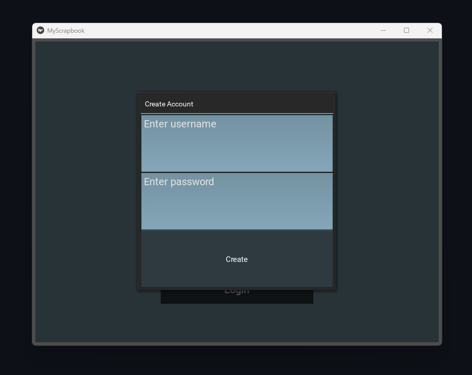

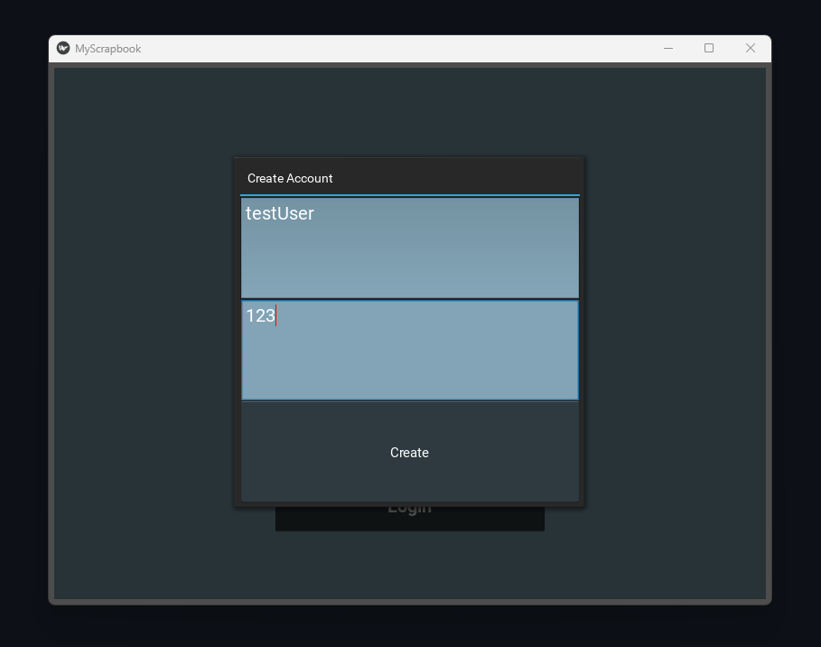

After creating an account, the user can then enter those credentials into the main username and password textboxes before pressing the "Login: button to enter the application.

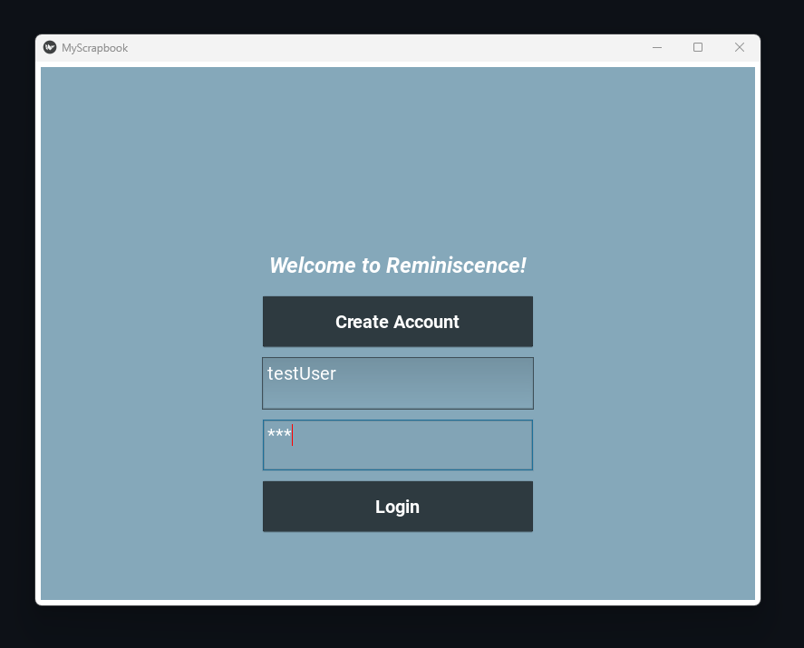

After successfully logging in, the user will find themselves in the main menu. From here they can choose between three buttons. 

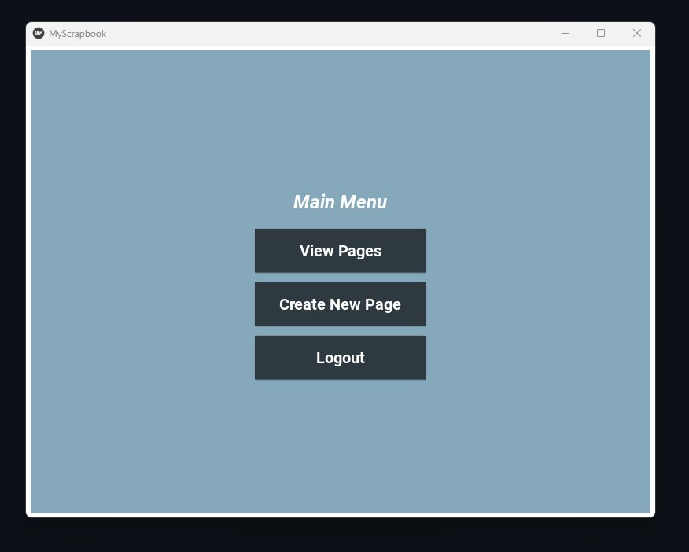

The first button is called "View Pages." When pressed, this takes the user to a view of all their created page collages with the feature of being able to scroll through the created collages with their mouse or scroll wheel. Since the user has not created any collages yet, this page is empty. The user can press "Main Menu" to return to that screen.

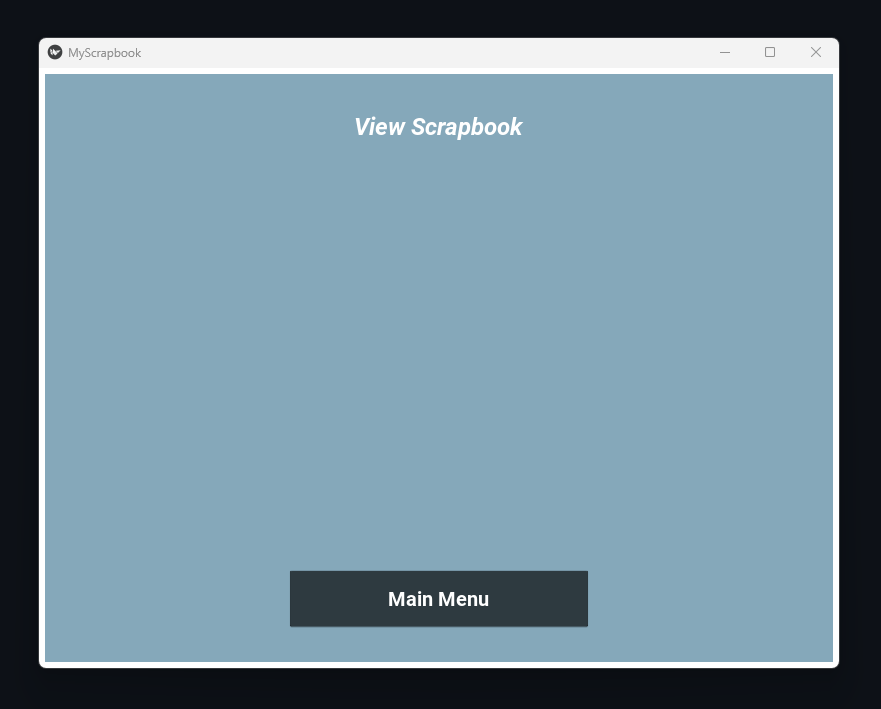

The second button is called "Create New Page" which as the name suggests, allows the user to create a new page collage. This screen is set up with a 2 by-2 grid of boxes that contain features to allow the user to either enter a note into a box of their choice or enter an image to take up the box space. This screen also contains three buttons of its own. The first is to return to the main menu. The second is the save the page collage to the "View Pages" screen. The last button is to clear the page grid back to a blank state.

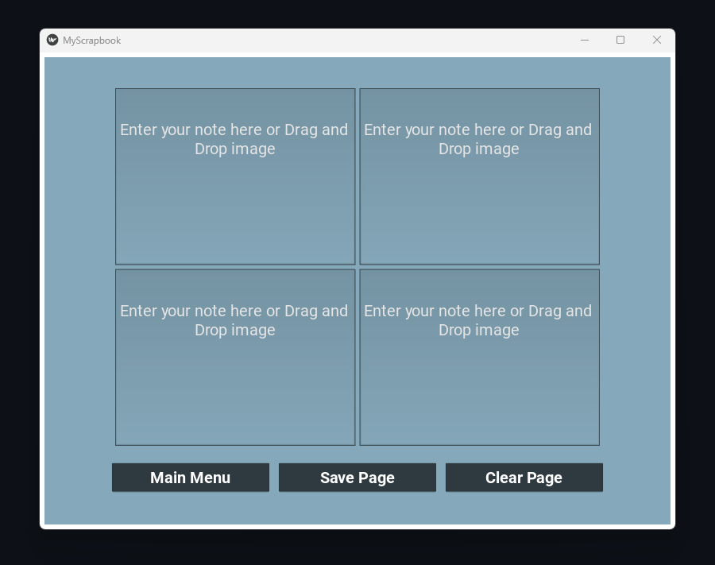

Here are a couple of examples of completed pages:

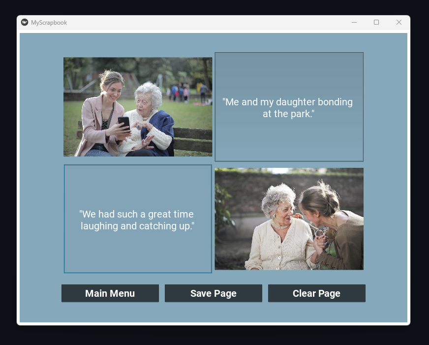
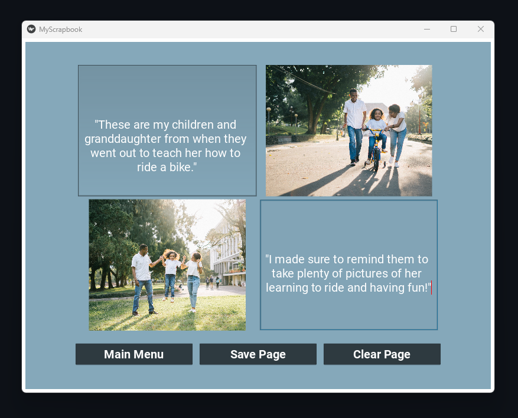

Stock image examples provided by pexels.com:
- Photo by Andrea Piacquadio: https://www.pexels.com/photo/two-adult-women-beside-each-other-3768114/
- Photo by Andrea Piacquadio: https://www.pexels.com/photo/cheerful-senior-mother-and-adult-daughter-using-smartphone-together-3791664/
- Photo by Agung Pandit Wiguna: https://www.pexels.com/photo/man-standing-beside-his-wife-teaching-their-child-how-to-ride-bicycle-1128318/
- Photo by Agung Pandit Wiguna: https://www.pexels.com/photo/a-man-and-a-woman-assisting-a-girl-while-jumping-1128317/

After every created page, the user can press the "Save Page" button to save the collage to their account directory within the application folder. They can then navigate back to the main menu and select the "View Pages" button to see their created collages. Note that the scroll function only works if there is not enough room to fit all of the user's collages on the same screen. This is why two example pages were added so we can see this feature in action.

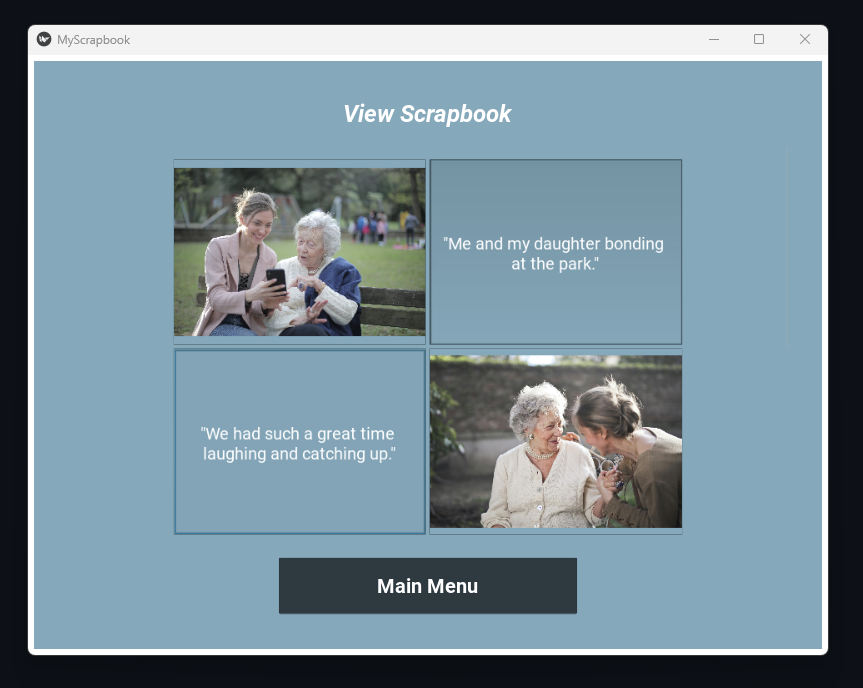
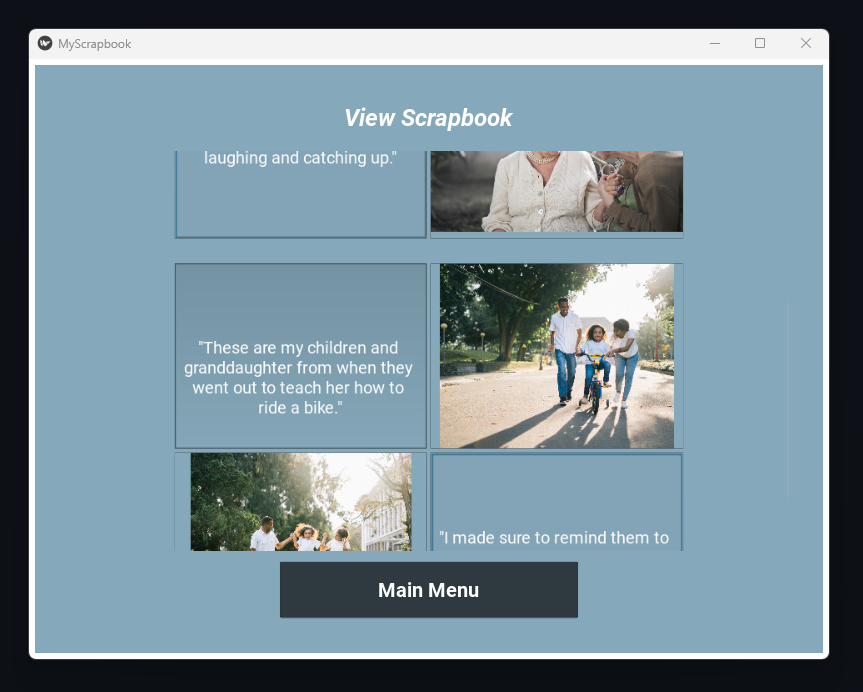

From here, if the user is finished with their page viewing, then they can navigate back to the main menu and then press the "Logout" button to return to the login screen. 

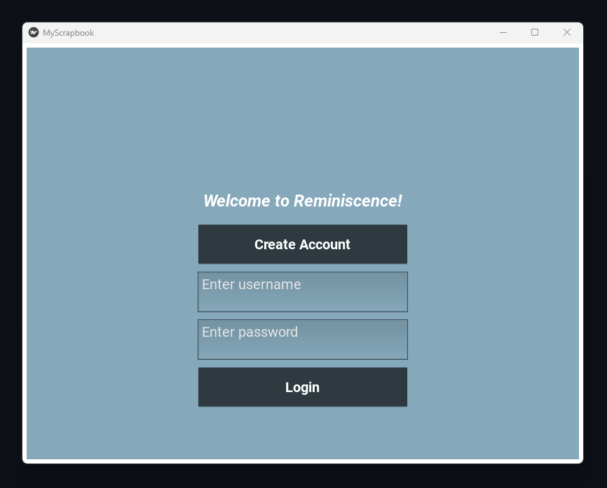

The main purpose of the login feature is to allow different users to see different pages depending on which pages they create. If another user is created and then navigates to the "View Pages" screen, they will not see the other user's collages mixed in with their own. 

This concludes the Reminiscence application demo.

## **Project Discussion and Conclusion:**

This project's aim was to develop a software application designed to bring happiness to the elderly by allowing them to create and view digital collages. Despite our ambitious goals, we faced several challenges and limitations during the development process. 

Looking back at this completed project, there were quite a few features and class-related concepts that we wanted to incorporate that we were ultimately unable to. In the initial mockup of the software, we wanted to allow users to drag and drop videos or audio files alongside images and written notes.

In terms of class-related concepts, It was difficult to come up with a way to bring concepts related to operating systems into an application described as software that will bring the elderly happiness. we attempted to incorporate concepts related to file management, threading, or security, however, certain issues limited the amount of these concepts we were able to incorporate. 

Successfully implemented features include using Python's OS library to allow users to drag and drop images into a dedicated internal directory. This directory system, which organizes files into user-specific sub-directories, ensures that users can view only their collages, enhancing the user experience by maintaining a personalized and uncluttered interface.

**Project Limitations:**

Major limitations we encountered include integrating video and audio files into the collages. Initially envisioned as a key feature, technical and time constraints led us to focus on note and image-based collages. Consequently, we decided to save the collages as PNG files, limiting the inclusion of interactive media like audio and video. 

Aside from this, we also had issues with integrating concepts of threading into the application. We reasoned that while the Kivy library handled the visual aspects of the GUI, our script could use threading whenever file management was involved to limit any possible issues related to the program stalling when those file-related background tasks were running. While this made sense to us at the time of conception, in practice, we came across errors from the Kivy library telling us that if any action taken related to a Kivy widget was requested by another thread then the request would be refused due to the nature of the single-threaded GUI frameworks that Kivy uses. As every aspect of our application relied on communication between the main script and Kivy widgets including the movement of files from one widget to another, threading was not possible to implement in a practical fashion.

**Class Concepts Application:**

The project provided us with practical experience in file management and an understanding of threading in application development. We planned to use threading to manage file operations in the background but faced compatibility issues with Kivy's single-threaded GUI framework. This experience highlighted the intricacies and limitations of integrating different systems and technologies in software development. 

**Privacy Features:**

An honorable mention of a class-related concept we tried to implement into our software was to integrate some level of privacy when it comes to viewing user-created page collages. By creating a user-specific collage viewing system, we ensured a certain level of privacy, although the security aspect was not fully developed. This feature could be enhanced in future iterations by implementing secure login mechanisms and encrypted storage of user credentials.

**Conclusion:**

In crafting Reminiscence, our aim was to create a software application that could bring joy to the elderly by allowing them to relive and preserve their cherished memories. Through this journey, we discovered the profound impact of empathy-driven design, where simplicity and accessibility became our guiding principles. As we reflect on our development process, we recognize that adaptability and creative problem-solving are at the core of any successful software project. While we had to make trade-offs, we also gained invaluable experience in integrating class concepts, addressing privacy considerations, and understanding the real-world challenges of application development.

Reminiscence may not have realized every feature we initially envisioned, but its power to capture and celebrate life's key moments remains a big part of this project. As we move forward, we carry with us the lessons and insights gained from this project, knowing that it will help our future endeavors in software development. Our hope is that Reminiscence can become a source of happiness for the elderly, reminding us of technology's potential to bridge generations and preserve the beauty of shared memories.
