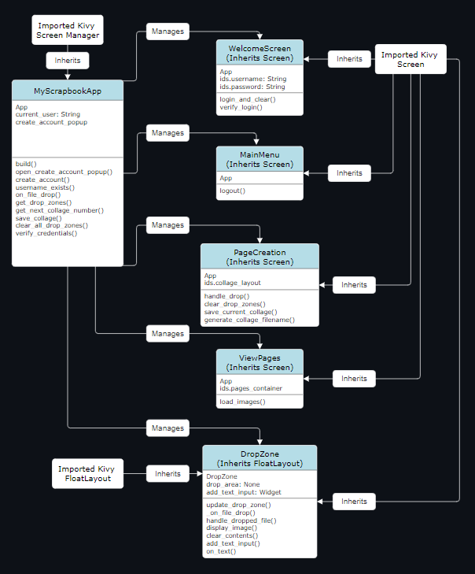
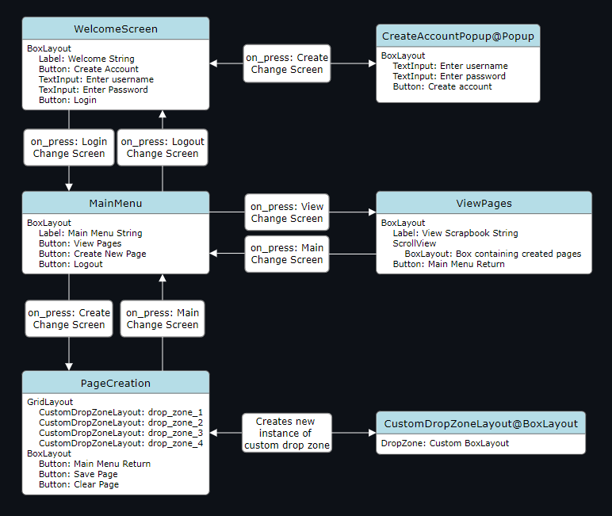

# **Reminiscence**

## **Insperation:**
This project was inspired by our team's CMPSC 472 Operating Systems course. We were tasked as our final project, to create a software application that would provide happiness to the elderly. The contents of this repository are the result of our interpretation of this prompt.

## **Project Objectives**

*Insert Objectives of the project*

## **Project Overview:**
Reminiscence is an application aimed at providing the elderly with a way to organize data related to their past memories. The software is designed to be a scrapbook-like application that would allow users to create notes and upload images to the software which can then be organized into a collage that is then saved to a scroll view of those collages. The application can be used to store, organize, retrieve, and display memories in the form of photos and notes. The software will showcase a friendly user interface for accessing these operations while utilizing our course-related concepts to ensure smooth management of the functions required to manipulate this memory data. Concepts like those related to file management can be used in managing stored data for quick retrieval. All together, Reminiscence will be able to provide the elderly with a way to construct a virtual scrapbook to create a personalized journey through their past memories.

## **Software Features:**

### Provide users with a way to:
- Upload memory data including Notes and Images.
- Allow users to browse their uploaded media by choosing where to place these data items on a GUI canvas.
  - Saves these canvas pages for later viewing.
- Provide the user with a User-Friendly GUI for them to traverse through the application.

## **Technology Stack:**
**As of the current date, our tech stack includes:**

**Coding Language:** Python

**GUI Tool:** Kivy
- Kivy’s TextInput Widget: Handles creating and editing text-based notes.
- Kivy’s Image Widget: Supports features related to manipulation of images.
- Kivy’s DropFile Widget: Supports drag and drop of files into GUI for a more GUI-friendly environment.

**File Manuvering and Storage:** 
- Python OS Module:

## **Code Structure:**
- Present a systematic diagram of the code's structure and explanations for easy understanding.

**Class Diagram of Main Code Script:**

**Explaination:**

The class UML diagram depicts a visual explaination of the main application of the MyScrapbookApp python script. The role of this script is the be the entry point of the application. It inherits from Kivy's Screen Manager class to manage all screens who are initiated by the build function.

When the program starts, the MyScrapbookApp() class initializes the ScreenManager and adds various screens to it including the welcome, mainMenu, viewPages, and PageCreation screens. This class also manages global functions related to some of the screens.

For the **welcome screen**, this class manages the creation of accounts and verification of credentials. 

For the **PageCreation screen**, It handles file drop events and delegates them to the appropriate DropZone widgets. It also handles events related to saving user-specific data in the form of collages or 'pages' in designated directories unique to each user.

**Screens Managed by ScreenManager:**

**WelcomeScreen:**

Purpose: Manages user login and account creation.
Functionality: Allows users to log in using their credentials or create a new account. Transitions to the MainMenu screen upon successful login.

**MainMenu:**

Purpose: Provides navigation to different parts of the application.
Functionality: Offers options to view saved pages, create new pages, or log out.

**ViewPages:**

Purpose: Displays saved scrapbook pages of the logged-in user.
Functionality: Loads and shows images from the user-specific saved_collages directory.

**PageCreation:**

Purpose: 
- Allows users to create new scrapbook pages.

Functionality: 
Users can drag and drop images or type notes into DropZone areas to compose a page. Provides options to save or clear the current page.

**Custom Widget: DropZone**

- Role: 
  - A custom widget that acts as a container for dropping files or entering text.

- Functionality: 
  - Handles dropped files (images) and displays them.
  - Allows users to enter text notes.
  - Can clear its contents and reset to default state.

#
**Class Diagram of Kivy Script:**

**Explaination:**

The Kivy UML diagram depicts a visual explaination of the myscrapbookapp.kv file that works alongside the main python script that defines the layout and stylization of each screen and custom widget used in the application.

**WelcomeScreen**

Purpose: This screen serves as the entry point for users. It includes options to create a new account or log in.

Components:
- Background and Border: Set with canvas.before and canvas.after to create a colored background and a border.
- BoxLayout: Vertically arranges all child widgets.
- Label: Displays the title 'Welcome to Reminiscence!' with specific font, size, and alignment.
- Buttons (Create Account and Login): Two buttons for creating an account and logging in. Styling is applied for font, size, and colors. They also have event bindings for their respective actions.
- TextInputs (username and password): Fields for users to enter their username and password. Customized with font, size, and color.

**CreateAccountPopup**

Purpose: A popup for account creation.

Components:
- BoxLayout: Contains the input fields and a button, arranged vertically.
- TextInputs (username and password): Fields for entering a new username and password.
- Button (Create): Submits the account creation form.

**MainMenu**

Purpose: The main navigation screen after logging in.

Components:
- BoxLayout: Vertically arranges the label and buttons.
- Label: Displays 'Main Menu' with styling.
- Buttons (View Pages, Create New Page, Logout): Provide navigation to other screens and logout functionality. Styled with custom colors and sizes.

**ViewPages**

Purpose: Displays the user's saved scrapbook pages.

Components:
- BoxLayout: Contains a label and a ScrollView.
- Label: Title for the page.
- ScrollView: Contains a BoxLayout (pages_container) that will dynamically load and display images.

**CustomDropZoneLayout**

Purpose: A custom layout for the DropZone areas in the scrapbook page.

Components:
- BoxLayout: Arranges a DropZone and a custom widget.
- DropZone: Custom widget for dropping images or text.

**PageCreation**

Purpose: Interface for creating new scrapbook pages.

Components:
- GridLayout: Arranges four CustomDropZoneLayout instances in a 2x2 grid.
- Button Layout: A horizontal BoxLayout containing three buttons for navigating to the main menu, saving the page, and clearing the page.

This structure is used to provide a clear and user-friendly interface, with each screen and widget designed to fulfill specific roles within the application, from user authentication to scrapbook creation and navigation. A light blue background with large white text is used to be easy on the eyes in consideration with the potential elderly users.

## **Software Installation and Usage:**

*Insert image-supported explaination of how to download and launch the software*

## **Software Functionality Testing:**

*Insert image-supported explaination of how to navagate the software*

## **Project Discussion and Conclusion:**

*Insert concluding discussion to the project's development*

